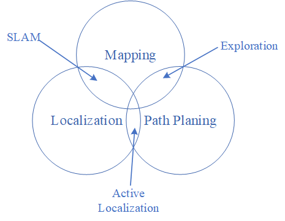
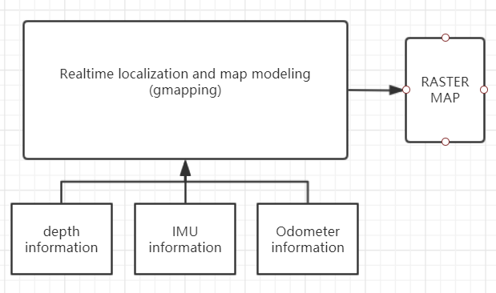
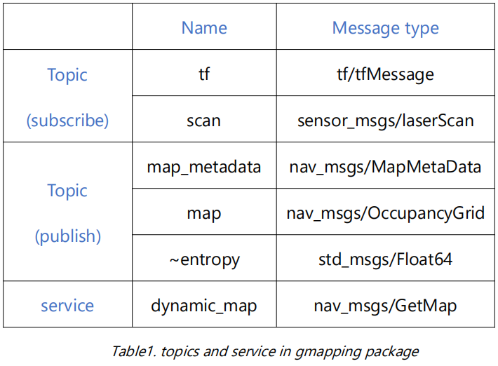
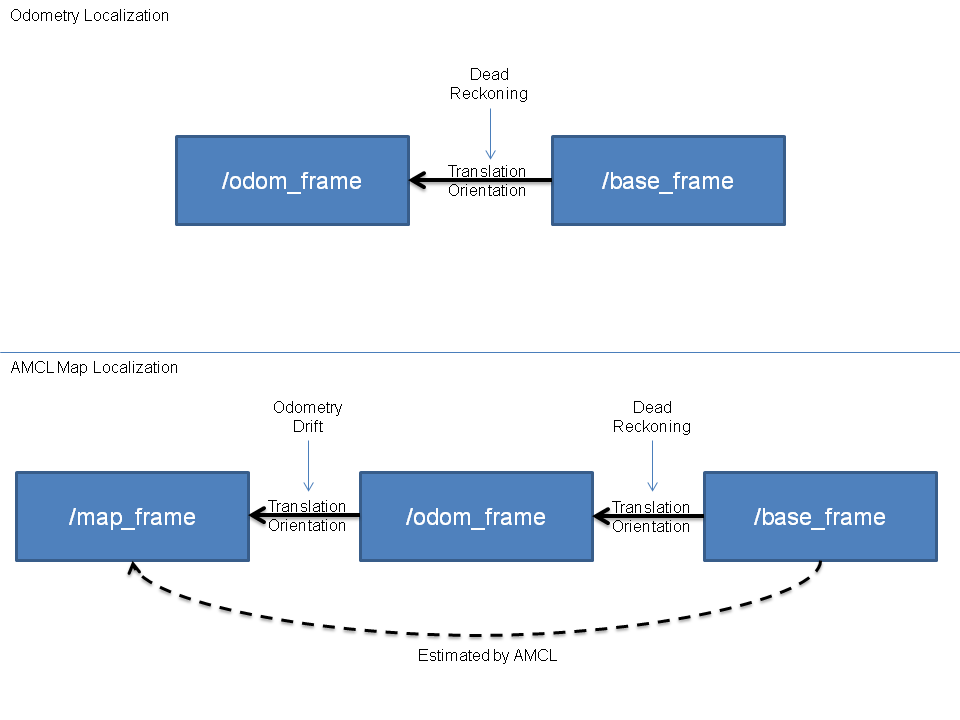
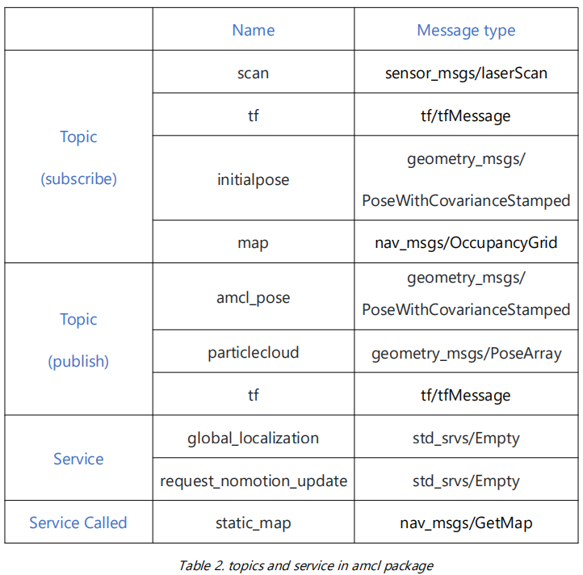
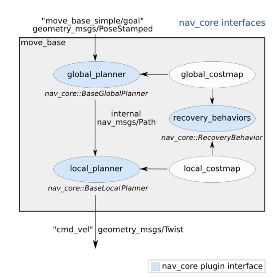
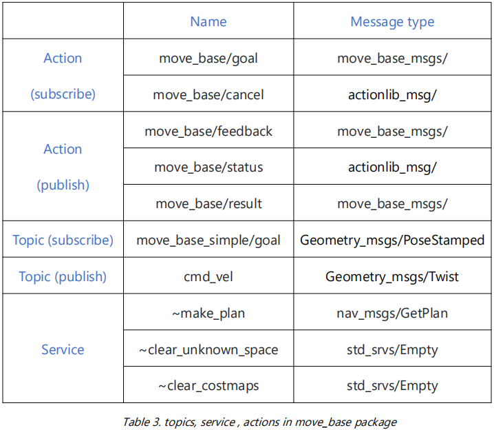

<p align="right">  
   
</p >

<p align="center">  
   
</p >

# <p align="center">Master of Computer vision and Robotics</p >   
<h3 align="center">Robotics Project</h3> <br>

<p align="center">Supervisors: Ralph SEULIN</p >  
<p align="center">Students: CHEN CHENG</p >  

## Contents
- [Introduction](#introduction)
- [Tasks to accomplish](#Tasks-to-accomplish)
- [Related techniques](#Related-techniques)
- [Implementation](#Implementation)
- [Conclusion](#Conclusion)
- [Demo videos](#Demo-videos)
- [References](#References)
## Introduction
 &nbsp;&nbsp;&nbsp;&nbsp;&nbsp;&nbsp;&nbsp;&nbsp;The Robot Operating System (ROS) is a flexible framework for writing robot software. It is a collection of tools, libraries, and conventions that aim to simplify the task of creating complex and robust robot behavior across a wide variety of robotic platforms. It can be considered as an API to make the process of developing a robotic related projects more flexible, and simplified. There will be no need for an extensive knowledge of the hardware in which it saves much effort and time in the development phase.   
 &nbsp;&nbsp;&nbsp;&nbsp;&nbsp;&nbsp;&nbsp;&nbsp;Many operating systems support ROS, such as ubuntu and windows. Among them ubuntu is the most used one for ROS develop since it's clean, stable, and easy to manage packages. For the development of this project, we used the Construct Web platform, which is an online robot working environment. The platform uses ubuntu as the main operating system with ROS kinetic, and uses Gazebo as the real-world simulator to simulate turtlebot 3 or other robot models. The platform provides us with a lot of useful courses, to enable us master the basic of Linux, Python and ROS. Through learning, we can realize the autonomous navigation of the turtlebot3 robot.

## Tasks to accomplish

The project goal is to apply the learned ROS techniques and packages to apply the navigation task on Turtlebot3:
1. **Motion Control**: Moving the robot around the environment using /cmd_vel topic.
2. **Mapping and localization**: Construct a map of the whole environment. We need to fully occupy the whole environment, then we need to localize the Robot.
3. **Path planning**: we need to publish a goal to move base navigation system in which Turtlebot3 can reach that goal without colliding with any obstacles.
4. **Waypoints Navigation**: Create waypoints that allows Turtlebot3 to navigate within the environment.

## Related techniques
   
    
 <h3>&nbsp;&nbsp;&nbsp;&nbsp;Map Building</h3>  
 &nbsp;&nbsp;&nbsp;&nbsp;&nbsp;&nbsp;&nbsp;&nbsp;In the field of robot, the common research problems include mapping, localization and path planning. Simultaneous localization and mapping belongs to the intersection of location and mapping.
              <p align="center">  
   
</p >

 &nbsp;&nbsp;&nbsp;&nbsp;&nbsp;&nbsp;&nbsp;&nbsp; **Gmapping package** provides **slam_gmapping** node. This node is implementing the gmapping SLAM algorithm. It creates a 2D map of the environment using the data the Robot is providing during movement like laser data, in which it will be transformed to an Occupancy Grid Map (OGM) data format (nav_msgs/OccupancyGrid.msg) where it represents a 2-D grid map and each cell of the grid represents the occupancy.
        &nbsp;&nbsp;&nbsp;&nbsp;&nbsp;&nbsp;&nbsp;&nbsp;The figure below is the framework of gmapping package.
    
<p align="center">  
   
</p >
         &nbsp;&nbsp;&nbsp;&nbsp;&nbsp;&nbsp;&nbsp;&nbsp;The topics and services in the gmapping packages and corresponding description are shown blow:
 <p align="center">  
   
</p >

- **tf**: used for the transformation between lidar coordinate system, base coordinate system and odometer coordinate system.  
- **scan**: used to subscribe to lidar scan data.  
- **map_metadata**: publishes map Metadata.  
- **map**: publishes map raster data.  
- **entropy**: releases estimation of robot poses distribution entropy.  
- **dynamic_map**: used to obtain map data.  


 <h3>&nbsp;&nbsp;&nbsp;&nbsp;Localization</h3>  
 
 &nbsp;&nbsp;&nbsp;&nbsp;&nbsp;&nbsp;&nbsp;&nbsp;**AMCL** (Adaptive Monte Carlo Localization) package provides amcl node. amcl is a probabilistic localization system for a robot moving in 2D. It implements the adaptive (or KLD-sampling) Monte Carlo localization approach , which uses a particle filter to track the pose of a robot against a known map.
&nbsp;&nbsp;&nbsp;&nbsp;&nbsp;&nbsp;&nbsp;&nbsp;The figure below is the framework of amcl package.
<p align="center">  
   
</p >


- **Odometry localization**: only use odometer data to process TF conversion between / base and / Odom;
- **AMCL map localization**: can estimate the pose information of the robot in the map coordinate system / map, and provide TF transformation between / base, / Odom, / map

&nbsp;&nbsp;&nbsp;&nbsp;&nbsp;&nbsp;&nbsp;&nbsp;The topics and services and corresponding description in amcl package are shown below:
<p align="center">  
   
</p >

- **Initialpose**: used to initialize the mean and covariance of the particle filter
- **map**: when parameter use_map_topic is set, amcl subscribes to map topic to obtain map data for laser localization
- **amcl_pose**: Robot pose estimation in map with covariance information
- **particlecloud**: Pose estimation ensemble maintained by particle filter
- **tf**: Publishing transformation from Odom to map
- **global_localization**: Initialization of global positioning, all particles are randomly scattered on the free area of the map
- **request_nomotion_update**: Manually perform updates and publish updated particles
- **static_map**: amcl calls the service to obtain map data

 <h3>&nbsp;&nbsp;&nbsp;&nbsp;Path Planning</h3>  
 
 &nbsp;&nbsp;&nbsp;&nbsp;&nbsp;&nbsp;&nbsp;&nbsp;**Move_base** package is the base of the navigation task where it connects all the navigation components. The move_base package provides an implementation of an action that, given a goal in the world, will attempt to reach it with a mobile base. The move_base node links together a global and local planner to accomplish its global navigation task.  
&nbsp;&nbsp;&nbsp;&nbsp;&nbsp;&nbsp;&nbsp;&nbsp;The figure below is the navigation framework based on move_base package.
<p align="center">  
   
</p >

- **Global planner**  
Global optimal path planning  
Dijkstra or a * algorithm  
- **Local planner**  
Plan the linear velocity and angular velocity of the robot to make them conform to the global optimal path.  
Real time obstacle avoidance  
Trajectory rollout and dynamic window approaches algorithm  
Search for multiple routes to avoid and travel, and select the optimal path by synthesizing the evaluation criteria  

<p align="center">  
   
</p >

&nbsp;&nbsp;&nbsp;&nbsp;&nbsp;&nbsp;&nbsp;&nbsp;The topics, services, actions and corresponding description in move_base package are shown below:

<p align="center">  
   
</p >
 
- **move_base/goal**: Motion planning goal of move_base
- **move_base/feedback**: Feedback information, including the coordinates of the robot chassis
- **move_base_simple/goal**: provide a non action interface for users who do not need to track the execution status of the target
- **cmd_vel**: velocity command output to robot chassis
- **~make_plan**: allow users to get a path plan for a given target from move_base, not perform it


## Implementation

<h3>&nbsp;&nbsp;&nbsp;&nbsp;Montion Control</h3> 

<h3>&nbsp;&nbsp;&nbsp;&nbsp;Map Building</h3> 


&nbsp;&nbsp;&nbsp;&nbsp;&nbsp;&nbsp;&nbsp;&nbsp;In order to realize the navigation function, the first step we need to do is to build a map with **slam_gmapping** node.   
1. Build the project package of navigation task, and create 2 folders named **launch** and **param**  in it to prepare for subsequent operation.  

2. Create a launch file named **start_mapping.launch**. It contains the following contents: start turtlebot3, launch slam_gmapping node, and set various parameters of the node.&nbsp;&nbsp;&nbsp;&nbsp;The most important parameters are:   
    - **maxUrange**: This parameter sets the distance the laser creates the map. The larger the range, the faster the map is created, and the less likely the robot is to get lost. The disadvantage is that it consumes more resources.
    - **throttle_scans**:  Very useful to reduce resource consumption.  
3. Execute the launch file to start the mapping operation.  
4. Launch the preconfigured Rviz for mapping to visualize the process of map building. The command is ```rosrun rviz rviz -d `rospack find turtlebot3_slam`/rviz/turtlebot3_slam.rviz```  &nbsp;&nbsp;&nbsp;&nbsp;We can see the unexplored maps in the map interface of Rviz:
-
-
-
-
5. Move turtlebot3 freely around to explore the map and complete the construction of the map. The command to move turtlebot3 with keyboard is ```roslaunch_ teleop turtlebot3_ teleop_ key.launch``` &nbsp;&nbsp;&nbsp;&nbsp;Where w and x control the forward and backward, a and d control the rotation, s clear the velocity. &nbsp;&nbsp;&nbsp;&nbsp;&nbsp;The map obtained after the complete exploration is as follows:

-
-
-
-

6. Save the map obtained in the previous step. First, we create a folder named **maps** in the package, and then we use the **map_saver** node form map_server package in ROS Navigation Stack, to read map data in the ROS service and save it. Its execution command is: ```rosrun map_ server map_ saver -f my_ Map;```  After saving, we will get two files in maps folder:
   - **my_map.pgm**：it contains the occupancy data of the map (the really important data)
   - **my_map.yaml**：it contains some metadata about the map, like the map dimensions and resolution, or the path to the PGM file.


<h3>&nbsp;&nbsp;&nbsp;&nbsp;Localizationg</h3> 

&nbsp;&nbsp;&nbsp;&nbsp;&nbsp;&nbsp;&nbsp;&nbsp;After completing the map construction and storage, we need to localize the actual pose of the robot with **amcl** node before navigation.

1. Create a launch file named **start_localization.launch**. It contains the following contents: launch turtlebot3, call generated map file, launch map_server node and amcl node, and set various parameters.    The most important parameters are: 

   - **min_particles, max_particles**: This parameter sets the number of particles the filter will use to localize the robot. The more you use it, the more accurate localization is, but the more resources it consumes.
   - **laser_max_range**: Max range of the laser beams.
   
2. Execute the launch file to start the localization operation.
   
3. Launch Rviz to visualize the process of localization. Use the same pre-configured Rviz as mapping, just add one more display: **Pose Array**, and subscribe it to particlecloud topic.    We can see in Rviz interface as follow:  
- 
- 
- 
- 
   
 
   &nbsp;&nbsp;&nbsp;&nbsp;&nbsp;&nbsp;&nbsp;&nbsp;Particle arraies used to measure the uncertainty of the robot current pose are relatively dispersed.
   
   
4. Move turtlebot3 around to localize the robot. The moving command is same as before. As we move the robot ,we can see the particles gradually clustering together, which means the estimated pose of robot getting close to real one.    When we get an accurate localization, the interface of Rivz should be shown as follows:  

- 
- 
- 
- 
   


 &nbsp;&nbsp;&nbsp;&nbsp;&nbsp;&nbsp;&nbsp;&nbsp;Particle arraies used to measure the uncertainty of the robot current pose gathering in a small area.
   
   
   
   

<h3>&nbsp;&nbsp;&nbsp;&nbsp;Navigation</h3> 

&nbsp;&nbsp;&nbsp;&nbsp;&nbsp;&nbsp;&nbsp;&nbsp;After mapping and localization, we can navigate the robot with **move_base_node**, which will provide Path planning and Obstacle avoidance. 

1. Create a launch file named **start_navigation.launch**. It contains the following contents: call generated map file, launch amcl localization node and move_base navigation node, load required parameters(local & global costmaps | local & global planners| move_base).   

2. Create all the parameter files required by the move_base node in **parm** folder  
    - costmap_common_params_burger.yaml  
    - local_costmap_params.yaml  
    - global_costmap_params.yaml  
    - move_base_params.yaml  
    - dwa_local_planner_params.yaml  

3. Execute the launch file to start the navigation operation.
4. Launch the pre-configured Rviz for navigation to visualize the process of navigation. The command is ```rosrun rviz rviz -d `rospack find turtlebot3_navigation`/rviz/turtlebot3_nav.rviz```. We can see the Rviz interface as below: 

- 
- 
- 
- 

5. Use the 2D Pose Estimate tool in Rviz to Localize the Robot in the Map. 
6. Use the 2D Nav Goal tool in Rviz to send a Goal(desired pose) to the Robot. In Rivz we can see the robot navigate to the goal pose without collision. We can also see the global and local planned path as below:  

- 
- 
- 
- 


<h3>&nbsp;&nbsp;&nbsp;&nbsp;Waypoints navigation</h3> 

&nbsp;&nbsp;&nbsp;&nbsp;&nbsp;&nbsp;&nbsp;&nbsp;After completing the single goal navigation, we can further navigate to pass a series of destinations with the **follow_waypoints** package. In this package, Waypoints server listens to publications into topic **/initialpose**, which is the **Estimate pose** that we place in Rviz, and store those poses until it’s instructed to send them to move_base to be executed.


1. Download the follow_waypoints package to workspace directory. The command is ```cd ~/catkin_ws/src``````git clone https://github.com/danielsnider/follow_waypoints.git```.
2. Build our workspace again and compile the new package. Execute in catkin_ws directory the command ‘’’catkin_make’’’,’’’ source /devel/setup.bash’’’,’’’rospack profile’’’.
3. Execute the navigation launch file and keep it running.
4. Start the waypoint server with a command ‘’’roslaunch follow_waypoints follow_waypoints.launch’’’.

5. Launch the pre-configured Rviz for navigation, and add a **PoseArray** subscribed to /waypoints topic. This PoseArray will show all waypoints we set. We rename the PoseArray and change its color to distinguish from localization pose estimates.

6. Set waypoints: In Rviz interface, select **PoseEstimate** and set it on the map as waypoints. **The last waypoint has to be same as current pose of the robot**. After setting waypoints, we get in webshell where we launched the waypoint server a message stating that it recieved the waypoint, and the Rivz interface is as below:

-
-
-
-

7.Start waypoints navigation by publishing in the topic **/path_ready** to start sending waypoints to movebase. The execution command is ‘’’rostopic pub /path_ready std_msgs/Empty -1’’’.  
          The demo vedio of waypoints navigation can be found in the next chapter


## Conclusion
&nbsp;&nbsp;&nbsp;&nbsp;&nbsp;&nbsp;&nbsp;&nbsp;The purpose of this project is to let us understand the related knowledge of robot navigation, and make a preliminary attempt. Robot navigation is mainly composed of three parts: map building, localization (Simultaneously 2 called SLAM) and path planning. In order to help us understand, the task we are required to complete in turn is to first build a mobile platform and make it subscribe / CMD_ Vel topic, then use slam_mapping node to build the scene map, and use AMCL node to localization, and then use move_base node which integrates all the above functions to implement path planning,  in the end tried multiple waypoints navigation.  
&nbsp;&nbsp;&nbsp;&nbsp;&nbsp;&nbsp;&nbsp;&nbsp;In order to prepare for the project, we need to study the corresponding basic courses, they are: linux4robotics, python4robotics, ROS basic in 5 days, ROS navigation in 5 days, mastering Turtle 3. All the related courses are studied and practiced on the construction platform, and the final project is unit 8 of the turtlebot3 course. There is no real machine operation in the whole process. The operating system supported by the construct platform is Ubuntu, and the simulated environment is gazebo. Construct is a very good robot virtual platform, the tutorial is written reasonably and efficiently. But there is a disadvantage that the platform is unstable. So in order not to be affected by the emergency crash, the simulation experiment needs to be carried out in advance.  
&nbsp;&nbsp;&nbsp;&nbsp;&nbsp;&nbsp;&nbsp;&nbsp;Through this whole project, I have gained experience in the principle of ROS, the use of Linux system, the framework of python, the principle of navigation technology, the use of various robots and markdown language in githup.
## Demo videos
- [Motion control](https://www.loom.com/share/c9cc85b31b6c4e6692d15c345f1530b0)
- [Map building](https://www.loom.com/share/c9cc85b31b6c4e6692d15c345f1530b0)
- [Localization](https://www.loom.com/share/c9cc85b31b6c4e6692d15c345f1530b0)
- [Navigation](https://www.loom.com/share/c9cc85b31b6c4e6692d15c345f1530b0)
- [Waypoints navigation](https://www.loom.com/share/c9cc85b31b6c4e6692d15c345f1530b0)
## References
1. [Construct Platform](http://theconstructsim.com)
2. [Wiki ROS](http://wiki.ros.org/)
3. [Construct course support](https://get-help.robotigniteacademy.com/c/course-support/masteringwithrosturtlebot3/27)
